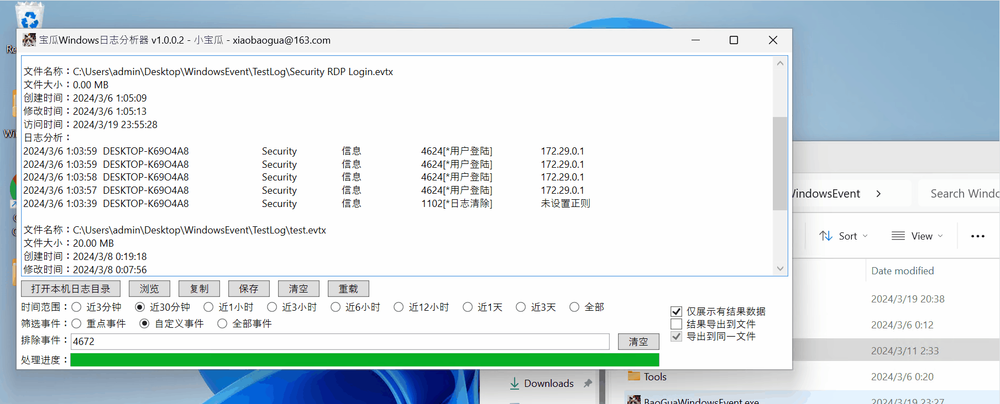

# BaoGuaWindowsEvent  
## 说明  
宝瓜Windows日志分析器，一款简洁方便的Windows日志分析工具。  
使用C#开发，需要依赖.net core 8.0框架，下载地址：https://aka.ms/dotnet-core-applaunch?missing_runtime=true&arch=x64&rid=win-x64&os=win10&apphost_version=8.0.2&gui=true

## 截图  
  
  
  
  

## 更新  

### 2024/6/7 1.0.0.9  

- 增加筛选建议  
- 增加事件资源展示功能  
- 丰富内置规则  

File: BaoGuaWindowsEvent.exe  
Size: 1539248 bytes  
File Version: 1.0.0.9  
MD5: E6552C948955C81DE4499CB061B9BE74  
SHA1: 731E44071D3FD7B179BAC5B68155F73AECD3FE6D  
CRC32: 108A0DDD  

### 2024/5/20 1.0.0.8  
- 优化日志解析界面
- 优化自定义规则
- 增加日志筛选
- 增加日志标签
- 增加大纲展示
- 增加生成文本摘要

File: BaoGuaWindowsEvent.exe  
Size: 1304405 bytes  
File Version: 1.0.0.8  
MD5: CE337B06528FEB20E83A68D29AAEE4A9  
SHA1: D73616BA16B59857CBD040416513013895FA1F36  
CRC32: 31ABC796  

### 2024/4/11 1.0.0.3  
更新日志：  
- 增加输出信息查找功能  
- 增加通过正则匹配日志信息  
- 修复了一些bug  

File: BaoGuaWindowsEvent.exe  
Size: 799947 bytes  
File Version: 1.0.0.3  
MD5: 40C071C9A0EA5145D14EEC239905D175  
SHA1: AC37CACDA9F58E3E300D5E7907F5418BA9E869A2  
CRC32: 98B49474  

### 2024/3/20 1.0.0.2  
更新日志：  
初版本发布  

文件信息：  
File: BaoGuaWindowsEvent.exe  
Size: 799947 bytes  
File Version: 1.0.0.2  
MD5: 34E89F8AFB4DC400C622EDB0AACC3CAC  
SHA1: AA26147DFD38994320421500CF0E16DFE35A1C3D  
CRC32: 0C38ED6F  

